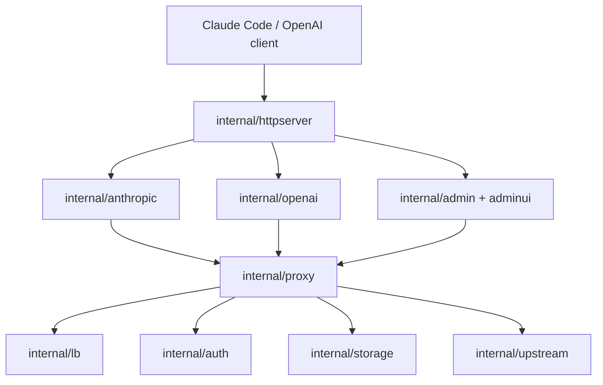

# grokbuild

## 项目状态

grokbuild-proxy 是 Go 编写的单进程、自托管 Grok Build 兼容代理。当前提供：

- Anthropic Messages：`POST /v1/messages`
- OpenAI Responses / Chat Completions / Models
- Grok OAuth 凭据导入、刷新、多账号选择与故障切换
- Admin JSON API 与内嵌 Web UI
- JSON 文件存储、Docker/Compose 部署

项目定位是个人或小团队在可信网络内自托管，不是多租户 SaaS。

## 架构



| 路径 | 职责 |
|------|------|
| `cmd/grokbuild-proxy` | 配置、依赖装配、服务生命周期 |
| `internal/httpserver` | 路由、鉴权、限流、探针、日志 |
| `internal/anthropic` | Anthropic 请求/响应/SSE 转换 |
| `internal/openai` | Responses 透传与 Chat 适配 |
| `internal/proxy` | 凭据选择、刷新、故障分类和切换 |
| `internal/lb` | 优先级轮询、粘滞、冷却 |
| `internal/auth` | Grok OAuth 导入、device flow、refresh |
| `internal/storage` | 本地凭据、Client Key 与元数据 |
| `internal/admin` | 受 admin key 保护的管理 API |
| `internal/adminui` | 零构建、Go embed 管理界面 |

## 开发与验证

```bash
go run ./cmd/grokbuild-proxy
go test ./...
go test -race ./...
go vet ./...
go build ./cmd/grokbuild-proxy
docker build -t grokbuild-proxy:local .
```

## 变更约束

1. 默认只监听 loopback；公网监听必须显式启用并在可信反向代理后使用。
2. 不记录 prompt、OAuth token、admin key 或 client key。
3. 协议字段不得静默丢弃：映射、透传或返回清晰错误，并更新兼容矩阵。
4. 凭据刷新、失败切换和存储修改必须包含并发/重启测试。
5. 普通测试不得依赖真实账号或网络；live smoke 必须显式选择运行。
6. 不引入 SaaS、多租户、数据库或 provider 插件范围，除非先完成设计评审。
